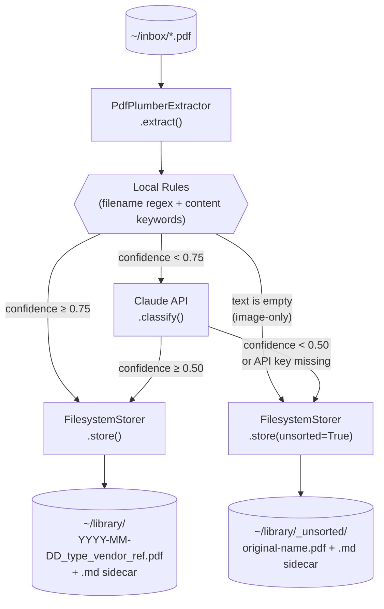
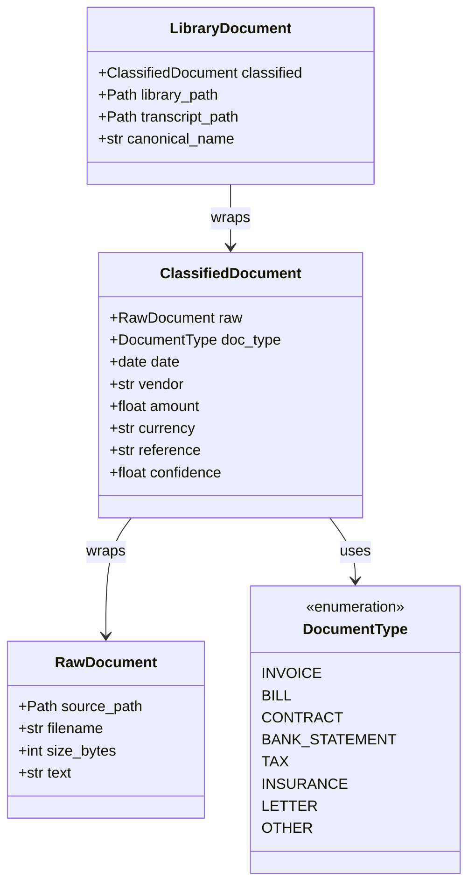
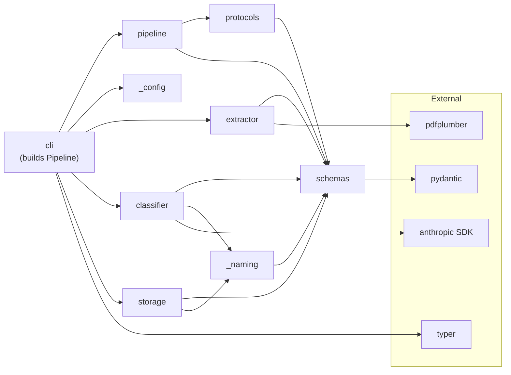
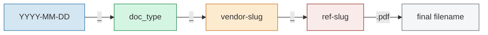

# PaperClaw — Design Document

A document-management CLI that classifies PDFs, renames them with a canonical convention,
and writes markdown transcript sidecars that an agent can search.

---

## Pipeline Overview



Per-file failures (corrupt PDF, extraction exception) are caught by `Pipeline`, logged,
and route the file to `_unsorted/`. A single bad file never aborts the batch.

---

## Domain Schemas



All models are **frozen** Pydantic v2 `BaseModel` instances — immutable value objects
that flow through the pipeline one stage at a time.

---

## Module Dependencies



`Pipeline` depends only on the `Protocol` interfaces in `protocols.py`, never on concrete
implementations. Tests can substitute fake extractors, classifiers, and storers without mocking.
`cli.py` owns the wiring step: it reads `_config`, constructs the concrete extractor / classifier /
storer, and passes them to `Pipeline`. `_naming.py` owns slugification and canonical-name
construction so that both the classifier (for sanitizing Claude output) and the storer (for
producing the final filename) share one implementation.

---

## Canonical Filename Convention



| Scenario | Example |
|---|---|
| Full metadata | `2024-11-01_invoice_acme-gmbh_INV-9912.pdf` |
| No date | `0000-00-00_invoice_acme-gmbh_INV-9912.pdf` |
| No reference | `2025-03-15_bill_vattenfall_noref.pdf` |
| Image-only / unsorted | `_unsorted/<original-stem>_<hash8>.pdf` |

**Collision policy (v0.1).** Filenames in `~/library/` and `~/library/_unsorted/`
must be unique. `_naming.py` appends an 8-character hash of the source file's content
(`sha256` truncated) as a final segment whenever a name already exists at the target.
Example: `2024-11-01_invoice_acme-gmbh_INV-9912_a1b2c3d4.pdf`. The hash is content-derived,
so re-running the same inbox is idempotent — the same input produces the same output name.

**Slugification.** Owned by `_naming.py`. Rules: lowercase; non-alphanumeric runs → `-`;
trim leading/trailing `-`; max 40 chars per segment. Empty input → the literal `unknown`
(or `noref` for the reference slot).

---

## Sidecar Transcript Format

Each PDF in `~/library/` has a `.md` sidecar with the same stem:

```
# 2024-11-01_invoice_acme-gmbh_INV-9912.pdf

**Source**: original-inbox-name.pdf
**Extracted**: 2024-11-02T09:14:33Z
**PaperClaw**: 0.1.0
**Type**: invoice
**Date**: 2024-11-01
**Vendor**: Acme GmbH
**Amount**: 99.0 EUR
**Reference**: INV-9912
**Confidence**: 90%

## Extracted Text

[full pdfplumber output here]
```

The structured header lets an agent answer queries like *"Which invoices arrived in November 2024?"*
with a simple grep, while the full text enables semantic search. `Source`, `Extracted`, and
`PaperClaw` provide provenance for debugging runs that produced surprising results.

**Privacy note.** The sidecar is plaintext: bank statements, medical bills, and tax documents
end up grep-able on disk. v0.1 ships no redaction; treat `~/library/` as sensitive.

---

## Classifier Decision Logic

Local rules score on two signals; the higher confidence wins and a filename hit tie-breaks
against a content hit for the same type.

| Signal | Confidence | Action |
|---|---|---|
| Filename regex hit | `0.85` | Skip Claude, store directly |
| Content keyword hit (no filename hit) | `0.60` | Skip Claude, store directly |
| Neither | `0.30` | Escalate to Claude (unless text is empty) |
| `raw.text` is empty / whitespace-only | `0.00` | **Skip Claude**, route to `_unsorted/` |

**Local rule patterns (bilingual):** the same patterns are matched against both the original
filename and the extracted body text.

| Pattern | Type |
|---|---|
| `rechnung`, `invoice` | INVOICE |
| `kontoauszug`, `statement` | BANK_STATEMENT |
| `vertrag`, `contract` | CONTRACT |
| `steuer`, `tax`, `finanzamt` | TAX |
| `versicherung`, `insurance` | INSURANCE |
| `stromrechnung`, `gasrechnung`, `bill` | BILL |

**Post-Claude routing.** The Claude branch returns a `ClassifiedDocument` whose confidence
the Pipeline inspects again:

| Claude confidence | Action |
|---|---|
| `≥ 0.50` | Store under canonical name in `~/library/` |
| `< 0.50` | Route to `~/library/_unsorted/` (preserve original stem + content hash) |

**API-key handling.** If `ANTHROPIC_API_KEY` is unset *and* a file would escalate to Claude,
the Pipeline routes it to `_unsorted/` instead of failing. The key is not validated at startup —
inboxes that classify entirely via local rules run without it.

---

## Configuration

Every runtime parameter is reachable from three sources. Resolution order, highest priority first:

1. **CLI flag** (e.g. `--model`, `--inbox`)
2. **Environment variable** (e.g. `PAPERCLAW_MODEL`)
3. **Config file** — TOML, loaded from `--config <path>` if supplied, else `$PAPERCLAW_CONFIG`,
   else `$XDG_CONFIG_HOME/paperclaw/config.toml` (falling back to `~/.config/paperclaw/config.toml`).
   Missing file is not an error.
4. **Built-in default**

`_config.py` owns this resolution and returns a single frozen `Settings` Pydantic model that the
rest of the codebase reads. Nothing else touches `os.environ` or argparse directly.

| Parameter | CLI flag | Env var | Config key | Default | Purpose |
|---|---|---|---|---|---|
| API key | `--api-key` | `ANTHROPIC_API_KEY` | `api_key` | *(optional)* | Anthropic SDK auth. Unset → low-confidence files route to `_unsorted/` instead of calling Claude. |
| Model | `--model` | `PAPERCLAW_MODEL` | `model` | `claude-sonnet-4-6` | Claude model ID for classification |
| Local-rules threshold | `--threshold` | `PAPERCLAW_THRESHOLD` | `threshold` | `0.75` | Confidence below which Claude is called |
| Claude min confidence | `--claude-min` | `PAPERCLAW_CLAUDE_MIN` | `claude_min` | `0.50` | Claude confidence below which the result is routed to `_unsorted/` |
| Inbox path | `--inbox` | `PAPERCLAW_INBOX` | `inbox` | `$HOME/inbox` | Directory scanned for `*.pdf` |
| Library path | `--library` | `PAPERCLAW_LIBRARY` | `library` | `$HOME/library` | Destination root; `_unsorted/` lives inside it |
| Config file path | `--config` | `PAPERCLAW_CONFIG` | *(n/a)* | *(see resolution rules)* | Location of the TOML config file |

**Example `config.toml`:**

```toml
model = "claude-sonnet-4-6"
threshold = 0.75
claude_min = 0.50
inbox = "/Users/me/Documents/scans"
library = "/Users/me/Documents/library"
# api_key = "..."   # prefer the env var for secrets
```

Secrets (`api_key`) are accepted in the config file but the env var path is recommended so the
key does not end up in a dotfile-synced TOML.

---

## Known Limitations (v0.1 scaffold)

- **Image-only PDFs**: `text=""` short-circuits to `_unsorted/` without calling Claude. Real vision support is milestone work.
- **Filename collisions**: content-hash suffix in `_naming.py` makes the fallback bucket collision-resistant and re-runs idempotent, but no rename-history / move-detection. Manual edits in `~/library/` are not reconciled.
- **Sidecar drift**: if the user manually renames a PDF or moves the `.md`, the pair can desync. PaperClaw never reads sidecars back, so this is silent.
- **No undo**: once a PDF is moved to `~/library/` the inbox copy is gone. A `--dry-run` flag is milestone work.
- **No PII redaction**: sidecars contain the raw extracted text; `~/library/` should be treated as sensitive storage.
