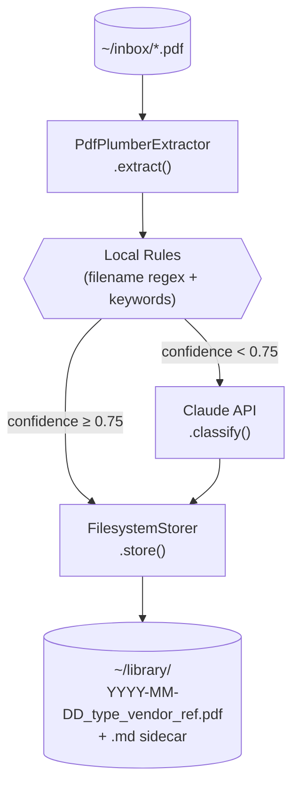
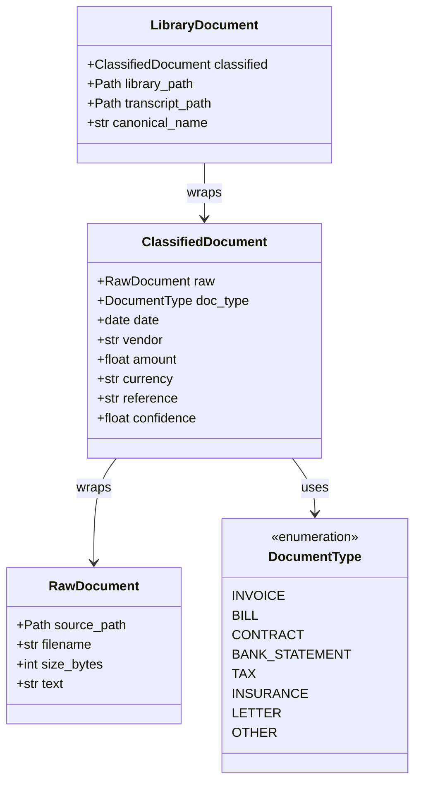
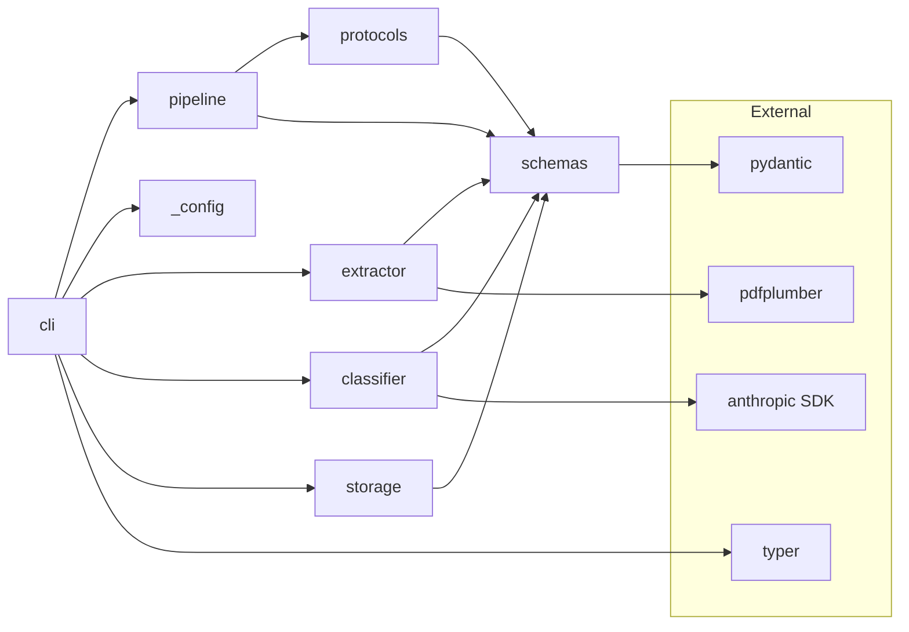
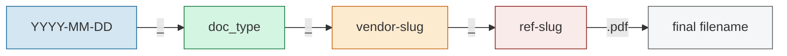

# PaperClaw — Design Document

A document-management CLI that classifies PDFs, renames them with a canonical convention,
and writes markdown transcript sidecars that an agent can search.

---

## Pipeline Overview



---

## Domain Schemas



All models are **frozen** Pydantic v2 `BaseModel` instances — immutable value objects
that flow through the pipeline one stage at a time.

---

## Module Dependencies



`Pipeline` depends only on the `Protocol` interfaces in `protocols.py`, never on concrete
implementations. Tests can substitute fake extractors, classifiers, and storers without mocking.

---

## Canonical Filename Convention



| Scenario | Example |
|---|---|
| Full metadata | `2024-11-01_invoice_acme-gmbh_INV-9912.pdf` |
| No date | `0000-00-00_other_unknown_noref.pdf` |
| No reference | `2025-03-15_bill_vattenfall_noref.pdf` |
| Image-only PDF | `0000-00-00_other_unknown_noref.pdf` |

Slugification: lowercase, non-alphanumeric runs → `-`, max 40 chars per segment.

---

## Sidecar Transcript Format

Each PDF in `~/library/` has a `.md` sidecar with the same stem:

```
# 2024-11-01_invoice_acme-gmbh_INV-9912.pdf

**Type**: invoice
**Date**: 2024-11-01
**Vendor**: Acme GmbH
**Amount**: 99.0 EUR
**Reference**: INV-9912
**Confidence**: 90%

## Extracted Text

[full pdfplumber output here]
```

The structured header lets an agent answer queries like *"Which invoices arrived in November 2024?"*
with a simple grep, while the full text enables semantic search.

---

## Classifier Decision Logic

```
filename match (regex)?
  yes → confidence 0.85  →  skip Claude
  no  → confidence 0.30  →  escalate to Claude API
```

**Local rule patterns (bilingual):**

| Pattern | Type |
|---|---|
| `rechnung`, `invoice` | INVOICE |
| `kontoauszug`, `statement` | BANK_STATEMENT |
| `vertrag`, `contract` | CONTRACT |
| `steuer`, `tax`, `finanzamt` | TAX |
| `versicherung`, `insurance` | INSURANCE |
| `stromrechnung`, `gasrechnung`, `bill` | BILL |

---

## Configuration

All runtime config is read from environment variables (no config file in v0.1):

| Variable | Default | Purpose |
|---|---|---|
| `ANTHROPIC_API_KEY` | *(required for Claude path)* | Anthropic SDK auth |
| `PAPERCLAW_THRESHOLD` | `0.75` | Confidence below which Claude is called |
| `PAPERCLAW_MODEL` | `claude-sonnet-4-6` | Claude model for classification |

---

## Known Limitations (v0.1 scaffold)

- **Image-only PDFs**: `text=""` → escalates to Claude → stub returns `OTHER/0.5`. Real vision support is milestone work.
- **Filename collisions**: same canonical name overwrites silently. Suffix counter (`_1`, `_2`) is a TODO.
- **No undo**: once a PDF is moved to `~/library/` the inbox copy is gone. A `--dry-run` flag is milestone work.
